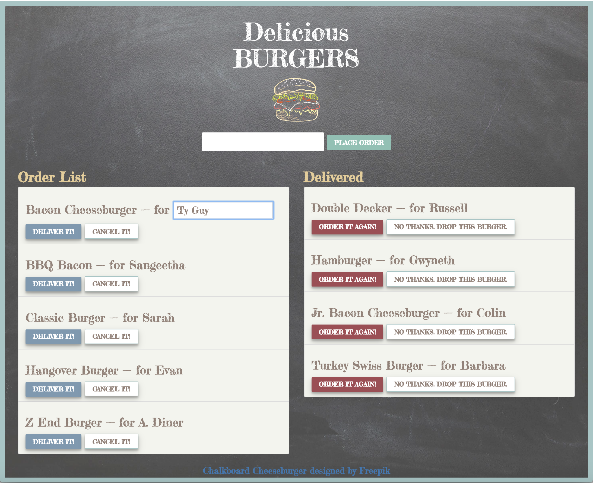

# Delicious Burgers

## Overview
- MySQL, Node, Express, Handlebars and Sequelize. Following the MVC design pattern and using Node and Sequelize to query and route data in the app, and Handlebars to generate HTML.

   
## Live Site
- https://murmuring-savannah-89031.herokuapp.com/


## Description
- Delicious Burgers is an app that lets users input a burger to order.

- Whenever a user submits a burger's name, the app will display the burger on the Order List on the left side of the page &mdash; waiting to be delivered. 

- Burgers display in alphabetical order based on Burger Name.

- Every burger customer defaults to 'A. Diner'.  Clicking on a customer name such as the 'A. Diner' default, allows the user to assign a customer name to  the burger.  Hitting the enter key saves the new Customer Name.  Removing focus from the text box cancels the new name assignment.  



- A Burger can be Cancelled - i.e. deleted from the Order List. 

- Each burger in the Order List also has a 'Deliver it!' button. When the user clicks it, the burger will move to the Delivered List on the right side of the page.

- Once a burger is delivered it is displayed in the Delivered List.  It can be reordered, which will move it back into the order list.  Or it can be deleted with the 'No Thanks.  Drop this Burger button.

- The app will store Order Burgers, Delivered Burgers and Customer Names in the database.


## Directory Structure
```
.
├── config
│   └── config.json
│
├── models
│   ├── burger.js
│   ├── customer.js
│   └── index.js
│
├── node_modules
│ 
├── package.json
│
├── public
│   └── assets
│       ├── css
│       │   └── burger_style.css
│       │── img
│       │    │── burger.png
│       │    └── chalkboard.png
│       ├── js
│           └── eat_burgers.js 
│
├── routes
│   └── burgers-controller.js
│
├── server.js
│
└── views
    ├── index.handlebars
    └── layouts
        └── main.handlebars
```

## Future Improvements:
1) Allow multiple Burgers per Customer Order.  
The Sequelize Burger and Customer models currently have a many burgers to one customer relationship, so there are joins in the queries, but the app does not implement this functionality on the front end.  

2) Better Validation.
- Better Burger Name validation.  The Burger Name cannot be empty.  Validate against a menu of available burgers. Replace alert with onpage message.
- Better Customer Name validation.  The Customer Name cannot be empty.  Enforce Alphabetical Characters in the Customer Name.  Replace alert with onpage message.

3) I totally enjoyed styling this page with the chalkboard look!  But, it would be nice to style the editable Customer Name so that is more obvious to the user.


## Technologies Used
- [Sequelize](http://docs.sequelizejs.com) - The database ORM used
- [Handlebars](http://handlebarsjs.com) - The templating language used
- [ExpressJS](https://expressjs.com/en/4x/api.html) - The Node framework used
- [NodeJS](https://nodejs.org/dist/latest-v8.x/docs/api/) - The JavaScript runtime used
- [Several NPM Packages](https://www.npmjs.com) - npm is the package manager for JavaScript and the world’s largest software registry


